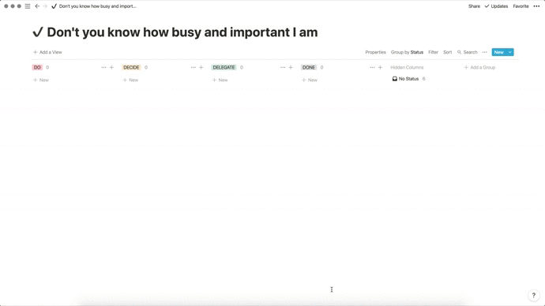
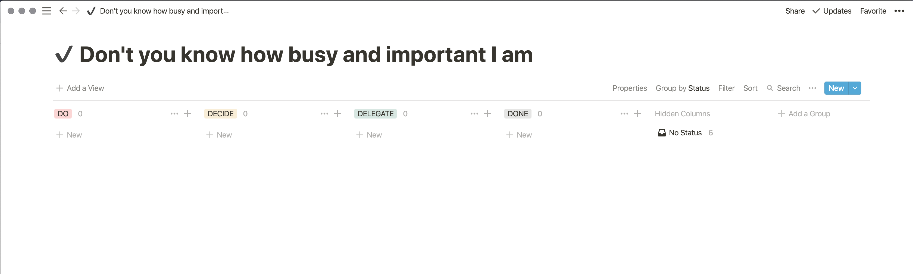

When it comes to productivity strategies, the Eisenhower Decision Matrix is a personal favourite. In addition to personal progress, I've found it to be very effective when product managing in a cross-functional team environment. The strategy revolves around Eisenhower's saying

<blockquote>"What is important is seldom urgent and what is urgent is seldom important"</blockquote>

The above graphic comes from an <a href="https://jamesclear.com/eisenhower-box" target="_blank">article</a> written by James Clear, but according to <a href="https://www.artofmanliness.com/articles/eisenhower-decision-matrix/" target="_blank">a post on Art of Manliness</a>, the matrix was first popularised by Stephen Covey. Both of the aforementioned articles are good resources if the "Eisenhower Box" is a foreign concept to you.

In an attempt to work a little smarter, I've started to invest some time into automating a few of my daily tasks and optimise my workflow. Enter two of my favourite productivity tools: Alfred and Notion. Alfred is a productivity tool for Mac, you could think of Alfred as Spotlight on steroids, and Notion is an all-in-one workspace destined for greatness.

<blockquote class="twitter-tweet">
Really enjoyed <a href="[https://twitter.com/hnshah?ref_src=twsrc^tfw](https://twitter.com/hnshah?ref_src=twsrc%5Etfw)">@hnshah</a> 's history of <a href="[https://twitter.com/NotionHQ?ref_src=twsrc^tfw](https://twitter.com/NotionHQ?ref_src=twsrc%5Etfw)">@NotionHQ</a> , easily my favorite product in years : <a href="[https://t.co/u17eO6Ey7e](https://t.co/u17eO6Ey7e)">[https://t.co/u17eO6Ey7e](https://t.co/u17eO6Ey7e)</a>
— Tim Höfer (@timhoefer) <a href="[https://twitter.com/timhoefer/status/1134692942663376896?ref_src=twsrc^tfw](https://twitter.com/timhoefer/status/1134692942663376896?ref_src=twsrc%5Etfw)">June 1, 2019</a></blockquote> 

Integrating Notion and Alfred required some effort, but here's the end result. (There is a slight delay, but bear in mind that I don't usually have Notion open when using the workflow, so the delay goes unnoticed.)

I use the following Notion board to utilise the Eisenhower Decision Matrix and organise daily tasks.

(Don't you know how busy and important I am? is a hat tip to one of my favourite artists, Tom Rosenthal, who is (a) a genius and (b) manages to capture the mindset of an entire generation in one song.)

I wanted to be able to add and recategorise tasks directly from my desktop and started digging around the internet for an Alfred workflow. The internet did not disappoint. Kevin Jalbert (link) published a very detailed notion-alfred workflow (link) using notion-py. The two repositories served as a valuable starting block for creating my own, as outlined below.

First off, you'll need

<ol>
  <li>Alfred 3+ with a powerpack</li>
  <li>Python 3</li>
  <li>A Notion Board</li>
</ol>

<ol>
  <li>Copy your Notion Token</li>
  <li>Create a blank workflow in Alfred</li>
  <li>Copy your Notion URLs</li>
  <li>
    Create your script(s) utilising notion-py
    <li>Folder structure (link to github)</li>
    <li>Script example</li>
  </li>
  <li>Hook up external script with a keyword trigger
  <li>Create Keyword</li>
  <li>Link External Script</li>
  <li>Add Notification</li>
  </li>
</ol>

Debugging Tips

<ul>
  <li>debugger</li>
  <li>ensure your script is executable `chmod +x your-script.py`</li>
  <li>make sure your script runs from the terminal</li>
</ul>
